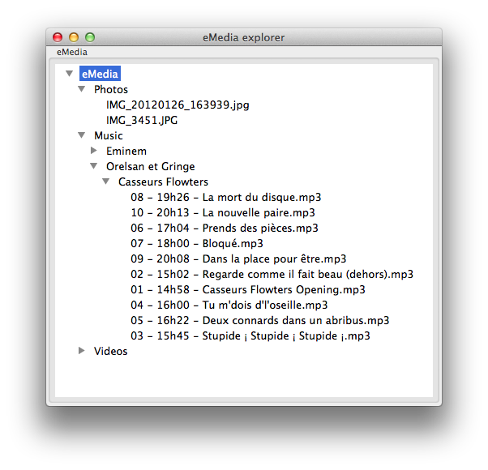

# eMedia

A simple UPNP mediaserver

> **This is a alpha version**. I plan evolutions that will involved major modifications in the database schema. So please **use this software for tests only**. The more you test, the more you report issues, the more we have chance to have something that's fit to your needs.
>
> Thanks in advance for your help.

## Install

> eMedia depend on ffmpeg and ffprobe (which is part of ffmpeg). For more informations about `ffmpeg` and how to install it, see [http://www.ffmpeg.org](http://www.ffmpeg.org).

```
git clone https://github.com/glejeune/emedia.git
cd emedia
make
./emedia start
```

See `./emedia --help` for more options.

> This new version comes with `emedia_explorer`. It's a very simple application, allowing you to explore the content of you media tree. This application is _experimental_. To use it, you need an Erlang version with `wxWidget`, launch `emedia` in console mode, then in the shell, execute `application:start(emedia_explorer).`.
> 

## Configuration

The configuration is store in the `config/emedia.config` file.

You can add comments in a configuration file. A comment start with a `%`.

A configuration accept the following parameters :

* `tcp_ip` : IP binding
* `tcp_port` : port used by the server
* `medias` : path to the differents media directories. This option must be repeated for every directory. The value is a path preceded by the type of media found in the directory (`audio`, `video` and `photo`). Example :

        {audio, "/my/audio/directory"}
        {video, "/my/video/directory"}
        {photo, "/my/photos"}
        {video, "/to/classify"}
        {audio, "/to/classify"}

    In this example, the `/to/classify` directory is given two times, once to specify that it contains videos and a second time for audio.
    
* `scan_interval` : time interval (in minutes) between every scan of the medias directories by the server
* `tmdb_api_key` : API key used to access [The Movie Database](https://www.themoviedb.org/)
* `ffprobe_path` : Path to `ffprobe`
* `ffmpeg_path` : Path to `ffmpeg`
* `db_path` : Path to the eMedia database
* `lang` : Language used to retrieve media informations

Example :

```erlang
{eme_config, [
  {port, 9090}, 
  {ip, "0.0.0.0"},
  {medias, [
    {audio, "/my/audio/directory"},
    {video, "/my/video/directory"},
    {photo, "/my/photos"},
    {video, "/to/classify"},
    {audio, "/to/classify"}
  ]},
  {scan_interval, 60},
  {tmdb_api_key, "mY4p1k3y"},
  {ffprobe_path, "/usr/local/bin/ffprobe"},
  {ffmpeg_path, "/usr/local/bin/ffmpeg"},
  {db_path, "~/.emedia"}
  {lang, fr}
]}
```

> The configuration file contains many other parameters, do not change those parameters unless you really know what you are doing.

## Architecture


## Plan

* <span style="text-decoration: line-through">Rewrite server using [paris](https://github.com/emedia-project/paris)</span> : **DONE**
* <span style="text-decoration: line-through">Rewrite `start.sh`</span> : **DONE**
* <span style="text-decoration: line-through">Rewrite scanner</span> : **DONE**
* Rewrite `eme_db` : **WIP**
* Add "update" to the media scanner (allowing to detect changes in the media database) : **WIP**
* Better media infos (using erlFFMpeg + emdbd) -> new media's classifications : **WIP**
* Refactor SOAP support : **WIP**
* Support additional ressources
* Add a web interface
* Use erlFFMpeg for media conversion
* Rewrite `eme_ssdp`
* Add DAAP support

## Licence

eMedia is available for use under the following license, commonly known as the 3-clause (or "modified") BSD license:

Copyright (c) 2013, 2014 Grégoire Lejeune <<gregoire.lejeune@free.fr>>

Redistribution and use in source and binary forms, with or without modification, are permitted provided that the following conditions are met:

1. Redistributions of source code must retain the above copyright notice, this list of conditions and the following disclaimer.
2. Redistributions in binary form must reproduce the above copyright notice, this list of conditions and the following disclaimer in the documentation and/or other materials provided with the distribution.
3. The name of the author may not be used to endorse or promote products derived from this software without specific prior written permission.

THIS SOFTWARE IS PROVIDED BY THE AUTHOR ``AS IS'' AND ANY EXPRESS OR IMPLIED WARRANTIES, INCLUDING, BUT NOT LIMITED TO, THE IMPLIED WARRANTIES OF MERCHANTABILITY AND FITNESS FOR A PARTICULAR PURPOSE ARE DISCLAIMED.  IN NO EVENT SHALL THE AUTHOR BE LIABLE FOR ANY DIRECT, INDIRECT, INCIDENTAL, SPECIAL, EXEMPLARY, OR CONSEQUENTIAL DAMAGES (INCLUDING, BUT NOT LIMITED TO, PROCUREMENT OF SUBSTITUTE GOODS OR SERVICES; LOSS OF USE, DATA, OR PROFITS; OR BUSINESS INTERRUPTION) HOWEVER CAUSED AND ON ANY THEORY OF LIABILITY, WHETHER IN CONTRACT, STRICT LIABILITY, OR TORT (INCLUDING NEGLIGENCE OR OTHERWISE) ARISING IN ANY WAY OUT OF THE USE OF THIS SOFTWARE, EVEN IF ADVISED OF THE POSSIBILITY OF SUCH DAMAGE.

