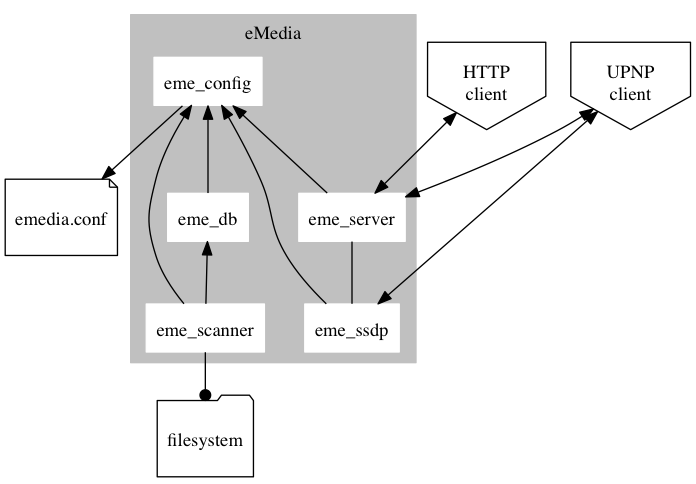

# eMedia

A simple UPNP mediaserver

> This software is a WIP !!!

## Install

> eMedia depend on ffmpeg and ffprobe (which is part of ffmpeg). For more informations about `ffmpeg` and how to install it, see [http://www.ffmpeg.org](http://www.ffmpeg.org).

    git clone https://github.com/glejeune/emedia.git
    cd emedia
    ./start.sh --compile

See `./start.sh --help` for more options.

## Configuration

You can update the configuration by creating a file named `emedia.conf` in `/etc`, `/Library/Application Support/eMedia/`, `~/Library/Application Support/eMedia`, `~/.emedia` and `.`. If many files exist, eMedia will read then in this order and update the configuration consequently.

> Be careful, the `media` parameter is cumulatif.

You can add comments in a configuration file. A comment start with a `#`.

A configuration accept the following parameters :

* `tcp_port` : port used by the server
* `max_conn` : maximum connections accepted by the server
* `medias` : path to the differents media directories. This option must be repeated for every directory. The value is a path preceded by the type of media found in the directory (`A` for Audio, `V` for Video and `P` for Photo). Example :

        A,/my/audio/directory
        V,/my/video/directory
        P,/my/photos
        V,/to/classify
        A,/to/classify

    In this example, the `/to/classify` directory is given two times, once to specify that it contains videos and a second time for audio.
    
* `scan_interval` : time interval (in minutes) between every scan of the medias directories by the server
* `tmdb_api_key` : API key used to access [The Movie Database](https://www.themoviedb.org/)
* `ffprobe_path` : Path to `ffprobe`
* `ffmpeg_path` : Path to `ffmpeg`
* `db_path` : Path to the eMedia database

Example :

    tcp_port = 9090
    max_conn = 50
    
    # Medias
    medias = V,/home/greg/videos
    medias = V,/var/lib/emedia/video
    medias = P,/home/greg/Photos
    medias = A,/var/lib/emedia/audio
    
    scan_interval = 60
    tmdb_api_key = AbCdEfGhIjKlMnOpQrStUvWxYz
    
    ffprobe_path = /usr/local/bin/ffprobe
    ffmpeg_path = /usr/local/bin/ffmpeg
    db_path = /usr/share/emedia

## Architecture

## Licences

eMedia is available for use under the following license, commonly known
as the 3-clause (or "modified") BSD license:

Copyright (c) 2013 Grégoire Lejeune <<gregoire.lejeune@free.fr>>

Redistribution and use in source and binary forms, with or without
modification, are permitted provided that the following conditions
are met:

1. Redistributions of source code must retain the above copyright notice, this list of conditions and the following disclaimer.
2. Redistributions in binary form must reproduce the above copyright notice, this list of conditions and the following disclaimer in the documentation and/or other materials provided with the distribution.
3. The name of the author may not be used to endorse or promote products derived from this software without specific prior written permission.

THIS SOFTWARE IS PROVIDED BY THE AUTHOR ``AS IS'' AND ANY EXPRESS OR IMPLIED WARRANTIES, INCLUDING, BUT NOT LIMITED TO, THE IMPLIED WARRANTIES OF MERCHANTABILITY AND FITNESS FOR A PARTICULAR PURPOSE ARE DISCLAIMED.  IN NO EVENT SHALL THE AUTHOR BE LIABLE FOR ANY DIRECT, INDIRECT, INCIDENTAL, SPECIAL, EXEMPLARY, OR CONSEQUENTIAL DAMAGES (INCLUDING, BUT NOT LIMITED TO, PROCUREMENT OF SUBSTITUTE GOODS OR SERVICES; LOSS OF USE, DATA, OR PROFITS; OR BUSINESS INTERRUPTION) HOWEVER CAUSED AND ON ANY THEORY OF LIABILITY, WHETHER IN CONTRACT, STRICT LIABILITY, OR TORT (INCLUDING NEGLIGENCE OR OTHERWISE) ARISING IN ANY WAY OUT OF THE USE OF THIS SOFTWARE, EVEN IF ADVISED OF THE POSSIBILITY OF SUCH DAMAGE.

### ucp (UnicodeCodePoints) 

Copyright: 2012 CGSMCMLXXV <<cgsmcmlxxv@gmail.com>>

Permission is hereby granted, free of charge, to any person obtaining a copy of this software and associated documentation files (the "Software"), to deal in the Software without restriction, including without limitation the rights to use, copy, modify, merge, publish, distribute, sublicense, and/or sell copies of the Software, and to permit persons to whom the Software is furnished to do so, subject to the following conditions:

The above copyright notice and this permission notice shall be included in all copies or substantial portions of the Software.

THE SOFTWARE IS PROVIDED "AS IS", WITHOUT WARRANTY OF ANY KIND, EXPRESS OR IMPLIED, INCLUDING BUT NOT LIMITED TO THE WARRANTIES OF MERCHANTABILITY, FITNESS FOR A PARTICULAR PURPOSE AND NONINFRINGEMENT. IN NO EVENT SHALL THE AUTHORS BE LIABLE FOR ANY CLAIM, DAMAGES OR OTHER LIABILITY, WHETHER IN AN ACTION OF CONTRACT, TORT OR OTHERWISE, ARISING FROM, OUT OF OR IN CONNECTION WITH THE SOFTWARE OR THE USE OR OTHER DEALINGS IN THE SOFTWARE.

